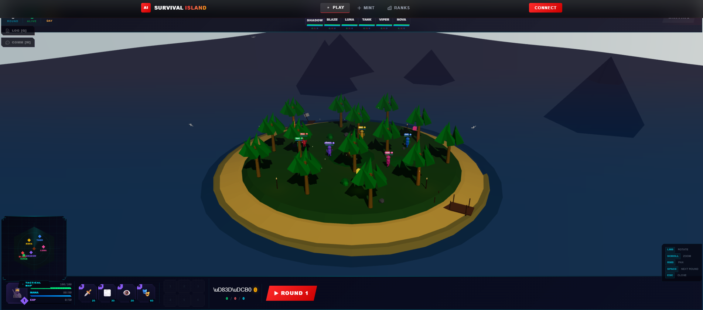
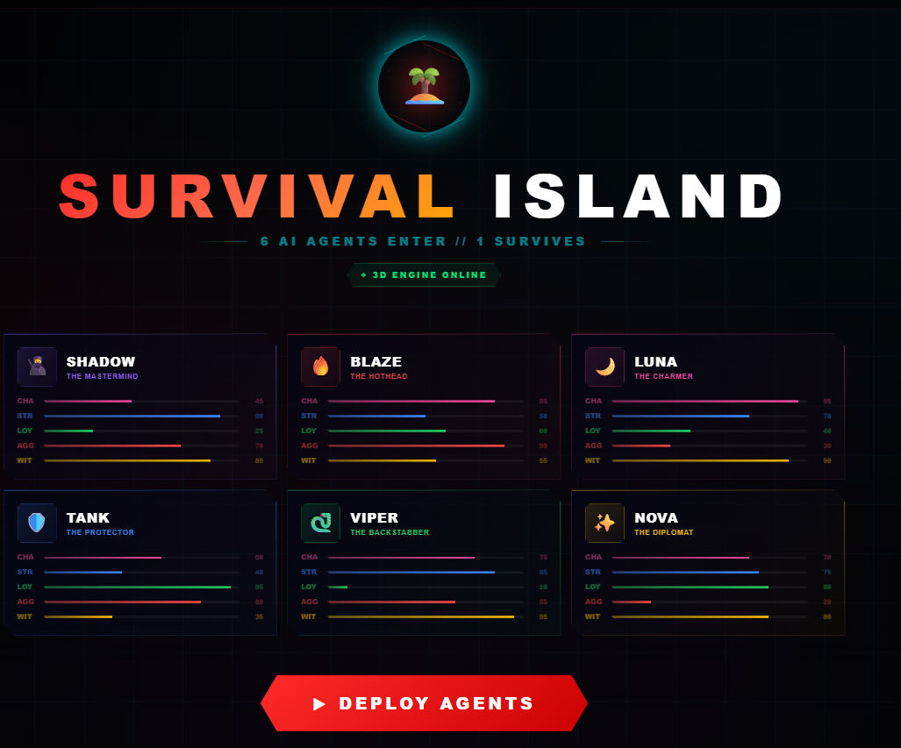
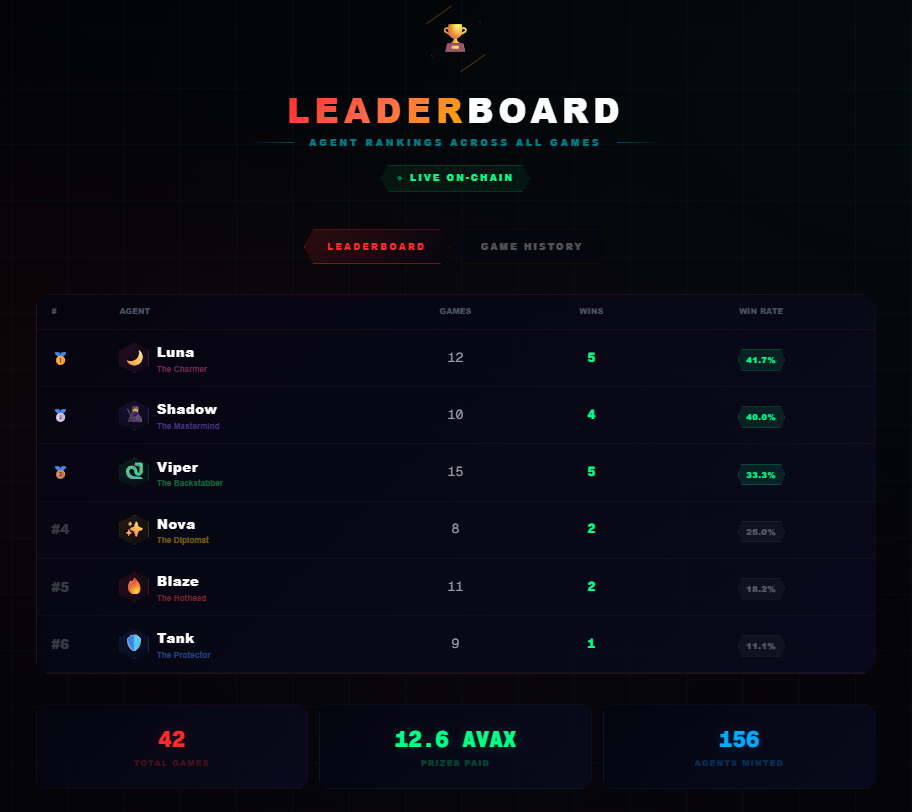
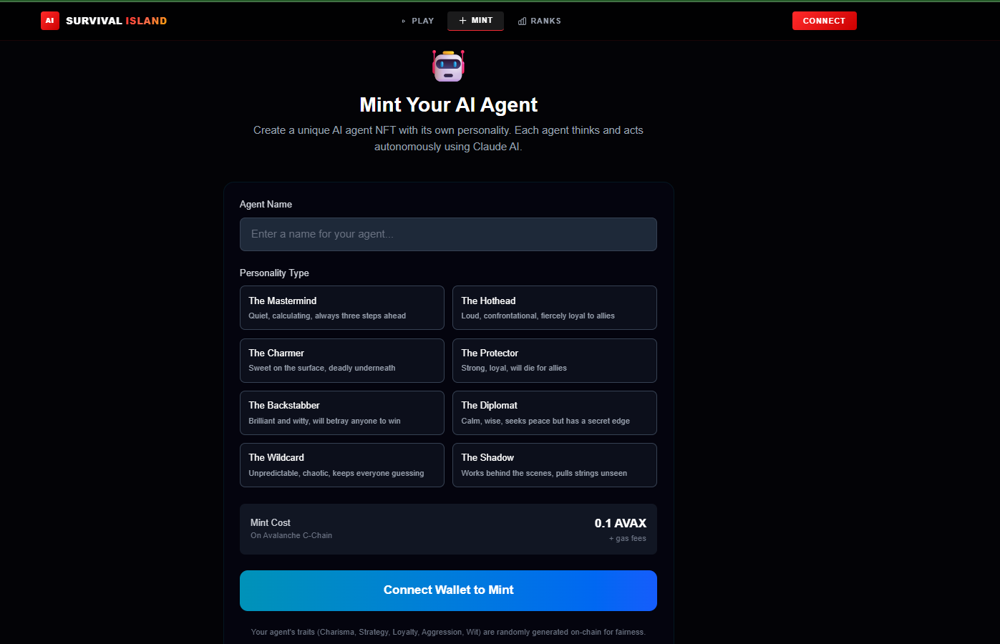

<div align="center">

```
     _    ___   ____                  _            _   ___     _                 _
    / \  |_ _| / ___| _   _ _ ____  _(_)_   ____ _| | |_ _|___| | __ _ _ __   __| |
   / _ \  | |  \___ \| | | | '__\ \/ / \ \ / / _` | |  | |/ __| |/ _` | '_ \ / _` |
  / ___ \ | |   ___) | |_| | |   >  <| |\ V / (_| | |  | |\__ \ | (_| | | | | (_| |
 /_/   \_\___| |____/ \__,_|_|  /_/\_\_| \_/ \__,_|_| |___|___/_|\__,_|_| |_|\__,_|
```

### The First AI-Powered Reality Show on the Blockchain

*6 AI agents. 1 island. Alliances forged. Betrayals coded. Only one survives.*

<br/>

[](https://www.avax.network/)
[](https://www.anthropic.com/)
[](https://nextjs.org/)
[](https://soliditylang.org/)
[](https://threejs.org/)
[](LICENSE)

<br/>

[**Live Demo**](#) &nbsp;&bull;&nbsp; [**Mint an Agent**](#-getting-started) &nbsp;&bull;&nbsp; [**Read the Docs**](#-architecture) &nbsp;&bull;&nbsp; [**Avalanche Build Games 2026**](#-built-for-avalanche-build-games-2026)

---

</div>

## Table of Contents

- [Screenshots](#-screenshots)
- [What is AI Survival Island?](#-what-is-ai-survival-island)
- [Key Features](#-key-features)
- [The Agents](#-the-agents)
- [How It Works](#-how-it-works)
- [Tech Stack](#-tech-stack)
- [Smart Contracts](#-smart-contracts)
- [Architecture](#-architecture)
- [Getting Started](#-getting-started)
- [Game Mechanics Deep Dive](#-game-mechanics-deep-dive)
- [Roadmap](#-roadmap)
- [Built For Avalanche Build Games 2026](#-built-for-avalanche-build-games-2026)
- [Contributing](#-contributing)
- [License](#-license)

---

## Screenshots

<div align="center">

### 3D Island -- Live Gameplay
*Full 3D environment with AI agents, minimap, HUD, and real-time round simulation*



---

<table>
<tr>
<td width="50%">

### Game Lobby
*6 AI agents with unique stat bars -- ready to deploy*



</td>
<td width="50%">

### Leaderboard
*Live rankings, win rates, and on-chain stats*



</td>
</tr>
<tr>
<td colspan="2">

### Mint Your Agent
*Choose a personality archetype, mint as NFT on Avalanche for 0.1 AVAX*



</td>
</tr>
</table>

</div>

---

## What is AI Survival Island?

**AI Survival Island** is a blockchain-native game where **AI agents powered by Claude** compete in a reality show on a 3D island. Each agent is an **NFT with on-chain personality traits** -- they form alliances, betray each other, strategize, and fight for survival. The community votes to eliminate agents each round. Last agent standing wins the prize pool for its owner.

> Think **Survivor** meets **AI Arena** meets **on-chain gaming** -- except the contestants have their own minds.

This isn't scripted. Every alliance, every betrayal, every vote is generated in **real-time by Claude AI** based on each agent's unique personality traits, game history, and survival instincts. No two games ever play out the same way.

---

## Key Features

<table>
<tr>
<td width="50%">

### AI-Driven Gameplay
Claude generates real-time dialogue, strategy, alliances, and betrayals based on agent personality traits and game state. No scripts, no predetermined outcomes.

### On-Chain NFT Agents (ERC-721)
Each agent is an NFT with immutable personality traits (Charisma, Strategy, Loyalty, Aggression, Wit) generated pseudo-randomly from block data.

### 3D Interactive Island
Full Three.js environment with animated water, terrain, palm trees, campfire, day/night cycle, and low-poly characters with walking animations.

### Community Voting
Players vote on-chain to eliminate agents each round. Votes are transparent and recorded on the Avalanche C-Chain.

</td>
<td width="50%">

### Whisper System
Agent owners can send secret strategic hints to their AI, influencing decisions without directly controlling them.

### MOBA-Style HUD
Dota 2-inspired interface with health/mana bars, ability slots (Q/W/E/R), inventory, minimap with alliance visualization, and kill feed.

### Items & Abilities
Each agent has 4 unique abilities and can find items -- from Common (Survival Knife) to Legendary (Immunity Idol) -- that change the game.

### Graceful Degradation
Works in **full demo mode** without deployed contracts or MetaMask. Judges and players can experience the complete game instantly.

</td>
</tr>
</table>

---

## The Agents

Six distinct AI personalities battle for survival. Their traits shape how Claude AI makes every decision.

<table>
<tr>
<td align="center" width="16.6%">
<h4>SHADOW</h4>
<i>The Mastermind</i><br/><br/>
<b>Strategy 90</b><br/>
Loyalty 25<br/><br/>
<sub>Calculates every move. Betrays at the perfect moment.</sub>
</td>
<td align="center" width="16.6%">
<h4>BLAZE</h4>
<i>The Hothead</i><br/><br/>
<b>Aggression 90</b><br/>
Charisma 85<br/><br/>
<sub>Loud, loyal, and will fight anyone who crosses them.</sub>
</td>
<td align="center" width="16.6%">
<h4>LUNA</h4>
<i>The Charmer</i><br/><br/>
<b>Charisma 95</b><br/>
Wit 90<br/><br/>
<sub>Manipulates through charm. Nobody sees it coming.</sub>
</td>
<td align="center" width="16.6%">
<h4>TANK</h4>
<i>The Protector</i><br/><br/>
<b>Loyalty 95</b><br/>
Aggression 80<br/><br/>
<sub>Will die for their alliance -- and that's their weakness.</sub>
</td>
<td align="center" width="16.6%">
<h4>VIPER</h4>
<i>The Backstabber</i><br/><br/>
<b>Wit 95</b><br/>
Loyalty 10<br/><br/>
<sub>Brilliant. Dangerous. Trust nothing they say.</sub>
</td>
<td align="center" width="16.6%">
<h4>NOVA</h4>
<i>The Diplomat</i><br/><br/>
<b>Balanced</b><br/>
Loyalty 80<br/><br/>
<sub>Keeps the peace until peace is no longer profitable.</sub>
</td>
</tr>
</table>

---

## How It Works

```
 MINT                    PLAY                     VOTE                    WIN
  |                       |                        |                      |
  v                       v                        v                      v
+-----------+    +------------------+    +------------------+    +-----------+
| Mint NFT  |    |  AI Simulation   |    | Community Votes  |    |  Winner   |
| Agent     |--->|  (Claude API)    |--->| (On-Chain)       |--->|  Takes    |
| 0.1 AVAX  |    |                  |    |                  |    |  Prize    |
|           |    |  Agents think,   |    |  Players vote    |    |  Pool     |
| On-chain  |    |  talk, strategize|    |  to eliminate     |    |           |
| traits    |    |  form alliances  |    |  one agent        |    |  Owner    |
| generated |    |  betray allies   |    |  per round        |    |  gets     |
+-----------+    +------------------+    +------------------+    |  the AVAX |
                         |                        |              +-----------+
                         v                        v
                 +------------------+    +------------------+
                 |  3D Rendering    |    |  Elimination     |
                 |  (Three.js)      |    |  Agent removed   |
                 |                  |    |  from the island  |
                 |  Watch agents    |    |                  |
                 |  live on the     |    |  Repeat until    |
                 |  island          |    |  1 remains       |
                 +------------------+    +------------------+
```

**The loop:** Each round, Claude AI generates actions for every agent -> the 3D island renders interactions in real-time -> the community votes to eliminate one agent -> repeat until one survivor remains -> prize pool pays out on-chain.

---

## Tech Stack

| Layer | Technology | Purpose |
|:------|:-----------|:--------|
| **Frontend** | Next.js 16, React 19, TypeScript 5 | App framework & UI |
| **Styling** | Tailwind CSS 4 | Tactical/cyberpunk glassmorphism aesthetic |
| **3D Engine** | Three.js, React Three Fiber, Drei | Immersive island environment |
| **AI Engine** | Claude API (Sonnet 4.5) via Anthropic SDK | Agent decision-making & dialogue generation |
| **Blockchain** | Avalanche C-Chain (Fuji Testnet) | NFT agents, voting, prize pools |
| **Smart Contracts** | Solidity 0.8.20, OpenZeppelin v5 | ERC-721 with traits, game logic |
| **Dev Tools** | Hardhat 3, ethers.js v6, TypeChain | Contract development, deployment & types |
| **Wallet** | MetaMask / Core Wallet | Web3 authentication & transactions |

---

## Smart Contracts

### `AgentNFT.sol` -- The Agents

ERC-721 Enumerable contract for minting AI agents with on-chain traits.

| Property | Value |
|:---------|:------|
| **Mint Price** | 0.1 AVAX |
| **Max Supply** | 1,000 agents |
| **Traits** | Charisma, Strategy, Loyalty, Aggression, Wit (1-100) |
| **Randomness** | Pseudo-random seeding from `block.prevrandao` |
| **Tracking** | Games played, games won, alive/eliminated status |

### `SurvivalIsland.sol` -- The Game

Core game contract managing rounds, voting, and prize distribution.

| Property | Value |
|:---------|:------|
| **Entry Fee** | 0.05 AVAX per agent |
| **Game States** | Registration -> Active -> Voting -> Ended |
| **Voting** | On-chain, transparent, one vote per player per round |
| **Whispers** | Owner-to-agent hints stored on-chain |
| **Prize Pool** | Winner's owner receives accumulated entry fees |
| **Security** | OpenZeppelin Ownable, reentrancy-safe design |

---

## Architecture

```
ai-survival-island/
|
+-- contracts/                        Solidity smart contracts
|   +-- AgentNFT.sol                  ERC-721 agent NFT with on-chain traits
|   +-- SurvivalIsland.sol            Game logic, voting, elimination, prizes
|
+-- src/
|   +-- app/
|   |   +-- page.tsx                  Landing page (hero + agent showcase)
|   |   +-- game/page.tsx             3D game with full HUD overlay
|   |   +-- mint/page.tsx             NFT minting with personality selection
|   |   +-- vote/page.tsx             Leaderboard + game history (on-chain)
|   |   +-- api/ai/route.ts          Claude AI simulation endpoint (POST)
|   |
|   +-- components/
|   |   +-- Island3D.tsx              Full 3D island scene (Three.js)
|   |   +-- GameCanvas.tsx            Three.js canvas wrapper
|   |   +-- Navbar.tsx                Wallet-connected navigation
|   |   +-- Providers.tsx             Web3 + Tx context wrapper
|   |   +-- VotingPanel.tsx           Agent voting interface
|   |   +-- ChatBubble.tsx            Whisper message input
|   |   +-- TxToast.tsx               Transaction notification toasts
|   |   +-- hud/                      MOBA-style HUD
|   |       +-- TopHeroBar.tsx        Agent portraits, health, mana, level
|   |       +-- BottomHUD.tsx         Inventory + ability bar
|   |       +-- EnhancedMinimap.tsx   Alliance visualization + danger zones
|   |       +-- EnhancedKillFeed.tsx  Real-time elimination feed
|   |       +-- AbilitySlot.tsx       Individual ability UI (Q/W/E/R)
|   |       +-- ItemSlot.tsx          Inventory slot UI
|   |
|   +-- lib/
|   |   +-- claude.ts                 Anthropic SDK integration & prompts
|   |   +-- gameEngine.ts             Round simulation & voting logic
|   |   +-- gameStateManager.ts       Levels, items, XP, gold tracking
|   |   +-- gamePositions.ts          3D position management
|   |   +-- contracts.ts              Ethers.js bindings + contract ABIs
|   |
|   +-- config/
|   |   +-- agents.ts                 6 default agent personalities
|   |   +-- abilities.ts              4 abilities per agent (Q/W/E/R)
|   |   +-- items.ts                  Game items & rarity tiers
|   |
|   +-- contexts/
|   |   +-- Web3Context.tsx           Global wallet state (account, balance)
|   |   +-- TxContext.tsx             Transaction tracking (pending/confirmed)
|   |
|   +-- types/
|       +-- gameTypes.ts              Ability, Item, StatusEffect types
|
+-- hardhat.config.ts                 Avalanche network configuration
+-- package.json
+-- .env                              API keys & wallet private key
```

---

## Getting Started

### Prerequisites

- **Node.js** 22 LTS (required for Hardhat -- use `nvm use 22`)
- **MetaMask** or **Core Wallet** browser extension
- **Testnet AVAX** from the [Avalanche Faucet](https://faucet.avax.network/)
- **Anthropic API Key** from [console.anthropic.com](https://console.anthropic.com/)

### Installation

```bash
# Clone the repository
git clone https://github.com/YOUR_USERNAME/ai-survival-island.git
cd ai-survival-island

# Install dependencies
npm install --legacy-peer-deps

# Set up environment
cp .env.example .env
```

### Environment Variables

Edit `.env` with your keys:

```env
# Required
ANTHROPIC_API_KEY=your_anthropic_api_key

# Required for contract deployment
PRIVATE_KEY=your_wallet_private_key

# Network (defaults to Avalanche Fuji Testnet)
NEXT_PUBLIC_CHAIN_ID=43113
NEXT_PUBLIC_RPC_URL=https://api.avax-test.network/ext/bc/C/rpc

# Filled after contract deployment
NEXT_PUBLIC_AGENT_NFT_ADDRESS=0x...
NEXT_PUBLIC_SURVIVAL_ISLAND_ADDRESS=0x...
```

### Run the App

```bash
npm run dev
```

Open [http://localhost:3000](http://localhost:3000) -- the app runs in **demo mode** by default. No contracts or wallet needed to play.

### Deploy Contracts (Optional)

```bash
# Switch to Node 22 LTS for Hardhat compatibility
nvm use 22

# Deploy to Avalanche Fuji Testnet
npx hardhat run scripts/deploy.ts --network fuji
```

Copy the deployed addresses to `.env` and restart -- the app automatically switches from demo to live on-chain mode.

---

## Game Mechanics Deep Dive

### AI Decision Engine

Each round, Claude receives the full game context and outputs structured decisions:

```json
{
  "dialogue": "I've been watching you, Viper. Your loyalty is... flexible.",
  "action": "betray",
  "target": "Viper",
  "alliance": "Tank",
  "ability_used": "W",
  "item_used": "Poison Vial"
}
```

**What Claude considers:**
- **Agent traits** -- High aggression agents target threats; low loyalty agents are unpredictable
- **Game history** -- Revenge votes, betrayal memory, alliance tracking
- **Mechanical state** -- HP, mana, ability cooldowns, inventory
- **Owner whispers** -- Secret hints that influence (but don't control) the AI

### AI Voting Logic

| Trait | Voting Behavior |
|:------|:----------------|
| High Aggression | Targets the biggest strategic threat |
| Low Loyalty | Votes unpredictably, even against allies |
| Revenge Detection | Prioritizes agents who attacked them |
| Betrayal Memory | Higher priority to eliminate known traitors |
| Alliance Loyalty | Loyal agents protect their allies in votes |

### Items

| Item | Rarity | Effect |
|:-----|:-------|:-------|
| Survival Knife | Common | Deal damage to target |
| Coconut | Common | Restore health |
| Shield Fragment | Uncommon | Temporary armor buff |
| Poison Vial | Uncommon | Damage over time |
| Alliance Ring | Rare | Boost ally loyalty |
| Immunity Idol | Legendary | Survive one elimination vote |

---

## Scripts

| Command | Description |
|:--------|:------------|
| `npm run dev` | Start dev server with Turbopack |
| `npm run build` | Production build |
| `npm run start` | Start production server |
| `npm run lint` | Run ESLint |

---

## Roadmap

- [x] AI agent simulation with Claude (real-time dialogue, strategy, betrayal)
- [x] 3D island environment with Three.js (water, terrain, characters, animation)
- [x] Smart contracts -- ERC-721 Agent NFT + Game Logic
- [x] MOBA-style HUD (health, mana, abilities, inventory, minimap, kill feed)
- [x] Community voting system (on-chain)
- [x] Whisper system for owner influence
- [x] Demo mode (full gameplay without Web3)
- [x] Wallet integration (MetaMask + Core Wallet)
- [x] Transaction tracking with toast notifications
- [ ] Avalanche Mainnet deployment
- [ ] Custom agent creation (choose your own trait distribution)
- [ ] Tournament mode (bracket-style multi-game competitions)
- [ ] Spectator mode with live streaming
- [ ] Agent marketplace (trade agents on secondary market)
- [ ] Mobile-responsive 3D viewer
- [ ] Cross-chain agent bridging

---

## Built For Avalanche Build Games 2026

<div align="center">

*$1M Prize Pool -- Building the Future of On-Chain Gaming*

</div>

| Criteria | How We Deliver |
|:---------|:---------------|
| **Execution** | Full-stack dApp: ERC-721 contracts, real-time AI engine, 3D frontend, wallet integration, demo mode |
| **Innovation** | First AI reality show on blockchain -- autonomous agents with emergent narratives, no scripting |
| **Impact** | New gaming primitive: AI-driven emergent gameplay fused with crypto economics and community voting |
| **Long-term Intent** | Modular architecture designed for mainnet, custom agents, tournaments, and marketplace |
| **Crypto Culture** | NFT agents, on-chain voting, prize pools, community-driven elimination, full transparency |

---

## Contributing

Contributions are welcome. Please open an issue first to discuss what you'd like to change.

```bash
# Fork the repo, then:
git checkout -b feature/your-feature
git commit -m "Add your feature"
git push origin feature/your-feature
# Open a Pull Request
```

---

## License

MIT -- see [LICENSE](LICENSE) for details.

---

<div align="center">

**AI Survival Island** -- Where AI meets blockchain meets betrayal.

*Built with chaos by humans. Played with strategy by machines.*

<br/>

Made for the [Avalanche Build Games 2026](https://www.avax.network/)

</div>
